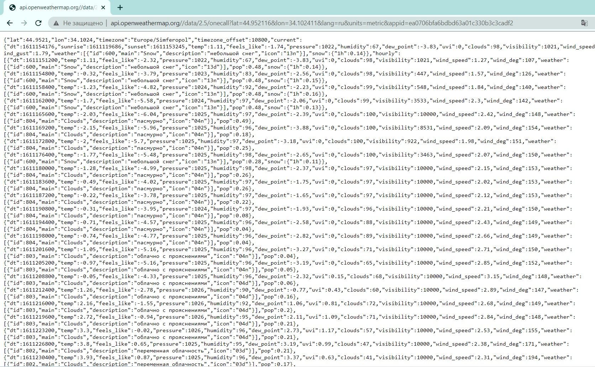
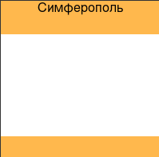
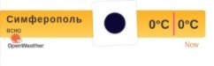

<p align="center">МИНИСТЕРСТВО НАУКИ  И ВЫСШЕГО ОБРАЗОВАНИЯ РОССИЙСКОЙ ФЕДЕРАЦИИ<br>
Федеральное государственное автономное образовательное учреждение высшего образования<br>
"КРЫМСКИЙ ФЕДЕРАЛЬНЫЙ УНИВЕРСИТЕТ им. В. И. ВЕРНАДСКОГО"<br>
ФИЗИКО-ТЕХНИЧЕСКИЙ ИНСТИТУТ<br>
Кафедра компьютерной инженерии и моделирования</p>
<br>

<h3 align="center">Отчёт по лабораторной работе № 1<br> по дисциплине "Программирование"</h3>

<br><br>

<p>студента 1 курса группы ИВТ-б-о-202(1)<br>

Макурина Дарья Игоревна<br>

направления подготовки 09.03.01 "Информатика и вычислительная техника"</p>

<br><br>

<table>

<tr><td>Научный руководитель<br> старший преподаватель кафедры<br> компьютерной инженерии и моделирования</td>

<td>(оценка)</td>

<td>Чабанов В.В.</td>

</tr>

</table>

<br><br>

<p align="center">Симферополь, 2020</p>

<hr>

 Цель:
 

1. Закрепить навыки разработки многофайловыx приложений;
2.  Изучить способы работы с API web-сервиса;
3.  Изучить процесс сериализации/десериализации данных в/из json;
4.  Получить базовое представление о сетевом взаимодействии приложений;

## Выполнение работы

### Задание 1

Заходим на сайт http://openweathermap.org/ и регистрируемся. Подтверждаем регистрацию на почте и логинимся на сайте. Переходим в наш аккаунт и генерируем API key. Полученный ключ представлен ниже.

ea0706bfa6bdbd63a01c330b3c3cadf2

Далее подставляем наш ключ в ссылку, которая имеет следующий вид.

http://api.openweathermap.org/data/2.5/forecast?id=524901&appid=[{API key}](https://home.openweathermap.org/api_keys)

Переходим по созданной ссылке и получаем результат в виде JSON кода.

Для получения прогноза погоды для Симферополя с почасовым интервалом необходимо отправить запрос : http://api.openweathermap.org//data/2.5/onecall?lat=44.952116&lon=34.102411&lang=ru&units=metric&appid=ea0706bfa6bdbd63a01c330b3c3cadf2


<center> Рисунок 1.1. Полученный запрос с сайта. </center>

### Задание 2

Чтобы получить текущее время в формате json необходимо отправить запрос на сайт worldtimeapi.org. 
Запрос для получение Симферопольского время будет выглядеть так : http://worldtimeapi.org/api/timezone/Europe/Simferopol.

### Полный исходный код серверного приложения:

```c++
#include <iostream>
#include "Include/nlohman/json.hpp"
#include "Include/cpp-httplib/httplib.h"
#include <iomanip>
#include <string>
#include <ctime>
#include <fstream>
using json = nlohmann::json;
using namespace httplib;
using namespace std;
json cache;
Client cli("http://api.openweathermap.org");
Client timez("http://worldtimeapi.org");

json get_json(){
  auto res = cli.Get("/data/2.5/onecall?lat=44.952116&lon=34.102411&lang=ru&units=metric&appid=ea0706bfa6bdbd63a01c330b3c3cadf2");
  if (!res){
    return ("Err");
  }
  int status = res->status;
  if (status <200 or status >=300){
    return ("Err");
  }
  return json::parse(res->body);
}
json get_cache(){
  json cache;
  std::ifstream cachename("cache.json");
  if (cachename.is_open()){
    string inform;
    getline(cachename, inform, '\0');

    if (!inform.empty()){
      cache = json::parse(inform);
    }
    cachename.close();
  }
  else{
    return ("Err");
  }
  return cache;
}
bool cachejson(json ca){
  cache = ca;
  ofstream cachename("cache.json");
  if (cachename.is_open()){
    cachename << ca.dump(4);
    cachename.close();
  }
  else return false;
  return true;
}
json get_time(){
  auto time = timez.Get("/api/timezone/Europe/Simferopol");
  if (!time){
    return("Err");
    return json::object();
  }
  int status = time->status;
  if (status < 200 or status >= 300){
    return ("Err");
  }
  return json::parse(time->body);
} 
json get_hourly_request(json &hourly){
  json hourly_request;
  int last = hourly.size()-1;
  json timenow = get_time();
  int currtime = timenow["unixtime"];
  if (hourly[last]["dt"] <= currtime){
    return json::object();
  }
  for (int i = 0; i <= last; ++i) {
      if (hourly[i]["dt"] > currtime) {
          hourly_request = hourly[i];
          return hourly_request;
      }
  }
}
```
```c++
#include <iostream>
#include <iomanip>
#include <fstream>
#include <string>
#include <ctime>
#include "Include/nlohman/json.hpp"
#include "Include/cpp-httplib/httplib.h"
using json = nlohmann::json;
using namespace httplib;
json get_json();
json get_cache();
json get_hourly_request(json &hourly);
bool cachejson(json ca);
json get_time();
void findandreplace(std::string &data, std::string toSearch, std::string replaceStr){
    size_t pos = data.find(toSearch);
    while(pos != std::string::npos){
        data.replace(pos, toSearch.size(), replaceStr);
        pos = data.find(toSearch, pos + replaceStr.size());
    }
}
void responce(const Request &req, Response &res){
    json body1;
    json prognoz1;
    body1 = get_cache();
    if (body1.empty()) {
        body1 = get_json();
        if (body1.contains("err")) {
            res.set_content(body1["err"], "text/plain");
        }
        else if (body1.contains("err")) {
            res.set_content(body1, "text/json");
        }
        cachejson(body1);
    }
        prognoz1 = get_hourly_request(body1["hourly"]);
        if (prognoz1.contains("err")) {
            res.set_content(prognoz1["err"], "text/plain");
            return;
        }
    std::string tamplname = "templ.html";
    std::ifstream tamplate(tamplname);
    std::string str;
    if (tamplate.is_open()){
        getline(tamplate,str, '\0');
        tamplate.close();
    }
    else {
        res.set_content("Error", "text/plain");
        return;
    }
    findandreplace(str, "{hourly[i].weather[0].description}", prognoz1["weather"][0]["description"]);
    findandreplace(str, "{hourly[i].weather[0].icon}", prognoz1["weather"][0]["icon"]);
    findandreplace(str, "{hourly[i].temp}", std::to_string(int(round(prognoz1["temp"].get<double>()))));
    res.set_content(str, "text/html");
}
void responceraw(const Request &req, Response &res){
    json body2;
    json prognoz2;
    body2 = get_cache();
    if (body2.empty()){
        body2 = get_json();
        if (body2 == "err") {
            res.set_content(body2, "text/json");
        }
    } else if (body2.contains("err")) {
        res.set_content(body2, "text/json");
    }
    prognoz2 = get_hourly_request(body2["hourly"]);
    if (prognoz2.contains("err")) {
            res.set_content(prognoz2["err"], "text/plain");
            return;
        }
    cachejson(body2);
    json out;
    out["temp"] = prognoz2["temp"];
    out["description"] = prognoz2["weather"][0]["description"];
    res.set_content(out.dump(), "text/json");
    }
int main(){
    Server bers;
    bers.Get("/", responce);
    bers.Get("/raw", responceraw);
    bers.listen("localhost", 1234);
}
```

### Полный исходный код клиентского приложения:

```python
from tkinter import *
import json
import requests

def reload_data(event=None):
	try:
		response = requests.get('http://localhost:1234/raw').content.decode("utf8")
		forecast_j = json.loads(response)

		desc.config(text=str(forecast_j["description"]))
		temp.config(text=str(forecast_j["temp"]) + "°C")
	except requests.exceptions.ConnectionError:
		pass

root = Tk()
root.title("Погода")
root.bind("<Button-1>", reload_data)
root.geometry('250x200')

_yellow = "#ffb84d"
_white = "#ffffff"
_w = 100        
_h = 30

top_frame =    Frame(root, bg=_yellow, width=_w, height=_h)
middle_frame = Frame(root, bg=_white,  width=_w, height=_h*3)
bottom_frame = Frame(root, bg=_yellow, width=_w, height=_h)

top_frame.pack(side=TOP, fill=X)
middle_frame.pack(expand=True, fill=BOTH)
bottom_frame.pack(side=BOTTOM, fill=X)

city = Label(top_frame, font=("Times New Roman", 12), text="Симферополь", bg=_yellow)
desc = Label(top_frame, font=("Times New Roman", 12), bg=_yellow)
temp = Label(middle_frame, font=("Times New Roman", 48), bg=_white)

city.pack(pady=0)
desc.pack(pady=0)
temp.pack(expand=True)

reload_data()
root.mainloop()
```

Скриншот графического интерфейса:



<center> Рисунок 1.2. Графический интерфейс. </center>

Скриншон браузера с загруженным виджетом:



<center> Рисунок 1.3. Браузер с виджетом. </center>

## Вывод по работе. 

Цель работы была успешно достигнута. Было выполнено:

- Создание сервера на языке С++, обращающегося к openweathermap.com и возвращающий виджет или описание и температуру в формате json
- Приложение с графическим интерфейсом, написанное на языке Python с использованием библиотеки Tkinter, получающее и обрабатывающее данные из сервера.
