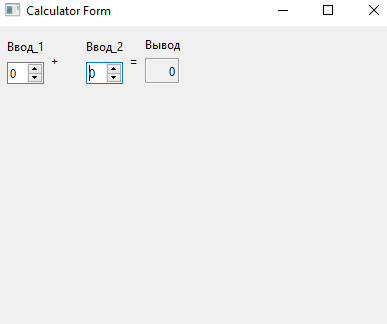
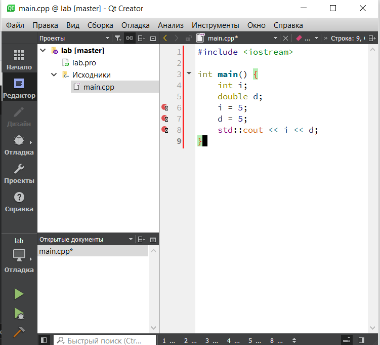

МИНИСТЕРСТВО НАУКИ  И ВЫСШЕГО ОБРАЗОВАНИЯ РОССИЙСКОЙ ФЕДЕРАЦИИ 
Федеральное государственное автономное образовательное учреждение высшего образования 
"КРЫМСКИЙ ФЕДЕРАЛЬНЫЙ УНИВЕРСИТЕТ им. В. И. ВЕРНАДСКОГО" 
ФИЗИКО-ТЕХНИЧЕСКИЙ ИНСТИТУТ 
Кафедра компьютерной инженерии и моделирования

 
<h3 align="center">Отчёт по лабораторной работе № 4  по дисциплине "Программирование"</h3>
  

студента 1 курса группы ИВТ-б-о-202(1) 
Макурина Дарья Игоревна 
направления подготовки 09.03.04 "Информатика и вычислительная техника"

  
<table>
<tr><td>Научный руководитель  старший преподаватель кафедры  компьютерной инженерии и моделирования</td>
<td>(оценка)</td>
<td>Чабанов В.В.</td>
</tr>
</table>
  

Симферополь, 2021

## Цель:

1. Установить фреймворк Qt;
2. Изучить основные возможности создания и отладки программ в IDE Qt Creator

## Постановка задачи
Настроить рабочее окружение, для разработки программного обеспечения при помощи Qt и IDE Qt Creator, а также изучить базовые возможности данного фреймворка.

## Выполнение работы
Для начала работы переходим на официальный сайт <https://www.qt.io/> и устанавливаем последнюю стабильную версию фреймворка Qt. Во время установки выбираем компоненты MinGW. После установки начинаем работу с готовым проектом Calculator Form Example. По ходу работы изменяем текст в файле .ui с "Input 1", "Input 2", "Output" на "Ввод 1", "Ввод 2" и "Вывод" (Рис. 1).

 

 Рис. 1 - Calculator Form 
  

### Ответы к заданию №2
1. Как изменить цветовую схему (оформление) среды?
   Инструменты -> Внешние -> Настроить -> Среда -> Интерфейс. Далее выбираем цветовые решения.
2. Как закомментировать/раскомментировать блок кода средствами Qt Creator? Имеется ввиду комбинация клавиш или пункт меню.
   В стандартных настройках ctrl+/, но есть возможность изменения сочетания клавиш на свои. Инструменты -> Параметры ->  Среда -> Клавиатура, далее находим строчку "закомментировать/раскомментировать" и выбираем свои горячие клавиши.
3. Как открыть в проводнике Windows папку с проектом средствами Qt Creator?
   Можно запустить Qt Creator из каталога build/bin.
4. Какое расширение файла-проекта используется Qt Creator? Может быть несколько ответов.
   .cpp .h .ui .pro .rc
5. Как запустить код без отладки?
   Нажав на комбинацию клавиш ctrl+R, либо кликом по клавише "запустить" в левом нижнем углу.
6. Как запустить код в режиме отладки?
   Кликом по клавише в нижнем левом углу - "начать откладку текущего проекта"
7. Как установить/убрать точку останова (breakpoint)?
   Кликом по свободномы месту слева от номера строки в окне выполняемого файла.

**В ходе 3-го задания** создаем консольное приложение без Qt, заменяем содержимое main.cpp на предложенные шаблон в задание. Устанавливаем точки останова в 6,7,8 строках (Рис. 2) и по шагу проверяем значения переменных.

 

 Рис. 2 - Точки останова в Qt Creator 
  

### Вопросы к заданию №3.6
* Чему равны переменные i и d в 6 строке; 
i = -858993460, 
d = -9.255963134931783e+61
* Чему равны переменные i и d в 7 строке;
i = 5, 
d = -9.255963134931783e+61
* Чему равны переменные i и d в 8 строке;
i = 5, 
d = 5,0

**Вывод:** В ходе данной лабораторной работы все поставленные задачи были выполнены: было настроенно рабочее окружение, для разработки ПО при помощи Qt и IDE Qt Creator, разобранны основные способы взаимодействия с данной средой. Также был изучен базовый материал по работе с данным фреймворком, а также создано консольное приложение без Qt. 